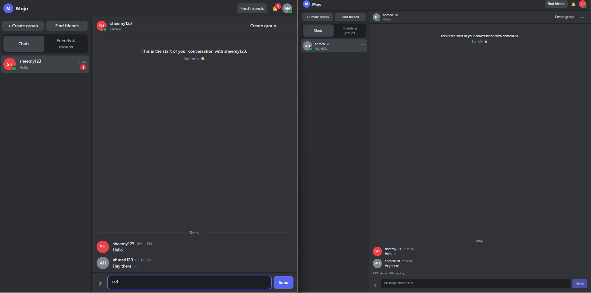

# Mojo

A discord clone fullstack application with a different vibe.




## Features

- Explore and Add friends
- Create groups
- Create/Start DM chats or group chats
- Receive notifications for important updates
- More yet to come


## Technologies


| Component | Technology |
| :--- | :--- |
| **Backend Frameworks** | NestJS, Socket.io (Streaming) |
| **Frontend Framework** | Vite/React SPA |
| **Database** | PostgreSQL 16 |
| **Cache** | Redis |
| **Security** | JWT (Stateless), OpenAuth 2.0 |
| **Documentation** | OpenAPI 3.0 / Swagger UI |
| **DevOps** | CICD, Docker, Docker Compose |


## Architecture Breakdown



Mojo is a **modular monolith**. A single NestJS process serves both the REST API and the
WebSocket server, backed by PostgreSQL for durable storage and Redis for caching and realtime
fan-out. The moving parts:

- **Frontend** — the client app that talks to the server over two channels: HTTPS for the REST
  API and WSS for the realtime socket connection.
- **Monolith server (NestJS)** — one process, two entry points:
    - **REST API server** — the request/response side. Handles auth (JWT + Google OAuth),
      profiles, friends, conversations, groups, and message sends. A REST response is the
      durable acknowledgement — the row is committed before the client gets its `2xx`.
    - **WebSocket server** — the realtime side. Streams live events (new messages, typing,
      presence, read receipts, group changes) to connected clients. See [WebSocket](#websocket).
- **PostgreSQL 16** — the primary data store. Everything durable (users, messages,
  conversations, groups, notifications, refresh-token hashes) lives here.
- **Redis 7** — caching and realtime plumbing. Holds presence counters, backs rate limiting,
  and acts as the Socket.io pub/sub adapter so broadcasts reach clients on **any** server
  instance, not just the one they're connected to.
- **External services** — Google OAuth for social login, an email service for transactional
  mail (verification, password reset), and object storage (S3) for uploads such as avatars.

**Persist-then-broadcast.** Domain services never touch the socket layer directly. They write
to Postgres inside a transaction and, only *after* the commit, emit an in-process event. A
dedicated listener translates those events into socket broadcasts. This guarantees the client
is never told about something that isn't already safely persisted.


### WebSocket

The WebSocket server is the backbone for realtime event streaming. It listens for and emits
socket events to clients connected across rooms. The streaming architecture consists of:


#### A. Socket.io Gateway server
1- Authenticates each client connection — a JWT is passed in the socket handshake and verified
   by a Socket.io middleware *before* the connection is accepted; unauthenticated sockets are
   rejected.
2- Links clients to their rooms on connect (their personal room and every conversation they
   belong to).
3- Tracks and broadcasts presence status as clients connect and disconnect.
4- Listens for the **Client-to-Server** events (typing, read markers).

#### B. Event Listener
1- Listens for in-process domain events, following the **persist-then-broadcast** paradigm.
2- Translates each committed domain event into the matching **Server-to-Client** broadcast to
   the right room. Because sends go through REST and persist first, there is intentionally **no
   message-send socket handler** — the socket layer only *broadcasts* messages, it never
   receives them.

#### C. Client
1- The socket client living in the frontend.
2- Sends **Client-to-Server** events and listens for **Server-to-Client** events.

#### D. Rooms
Clients are subscribed to rooms; within a room they publish and receive events. The rooms are:
- `user:<id>` — a user's personal room. Delivers user-scoped events: presence changes,
  notifications, and new-conversation / group-update pushes.
- `conversation:<id>` — a conversation's room. Delivers conversation-scoped events: typing,
  new messages, deletions, and read receipts. Since **a group is a conversation**, group and
  membership events are broadcast to this same room (there is no separate `group:<id>` room).

#### E. Events

##### Client-to-Server
Sent from client to server:
- `typing:start`
- `typing:stop`
- `message:read`

##### Server-to-Client
Sent from server to client:
- `message:new`
- `message:deleted`
- `message:status` (delivery / read receipts)
- `typing:start`
- `typing:stop`
- `presence:changed`
- `notification:new`
- `conversation:new`
- `group:updated`
- `group:deleted`
- `member:added`
- `member:removed`
- `member:role_changed`

**Example — typing indicator (a client-driven event):**
1- A user starts typing in the app.
2- The client emits **`typing:start`**.
3- The **Gateway server** receives and resolves the event.
4- The Gateway broadcasts **`typing:start`** to the **`conversation:<id>`** room.
5- Every other participant in that room receives it.

**Example — new message (a persist-then-broadcast event):**
1- The client sends the message over **REST**, not the socket.
2- The service writes it to Postgres and commits — the `201` response is the durable ack.
3- After commit, the service emits an in-process `message.created` event.
4- The **Event Listener** turns it into a **`message:new`** broadcast to the
   **`conversation:<id>`** room.
5- Every participant — including the sender's other devices — receives the new message live.


## Open Source Contribution Guide

Contributions are welcome. Here's the quick path to getting a change merged:

1. **Fork & clone** the repo, then create a feature branch off `main`:
   ```bash
   git checkout -b feat/your-change
   ```
2. **Spin up local infra** (Postgres 16 + Redis 7) and install dependencies from `server/`:
   ```bash
   cd server
   docker compose up -d
   npm ci
   npm run prisma:migrate
   ```
3. **Run it** in watch mode while you work:
   ```bash
   npm run start:dev
   ```
4. **Follow the conventions.** Controllers stay thin, all logic lives in services, and domain
   events are emitted only *after* the DB transaction commits. When in doubt, the design docs
   under `server/docs/` are the source of truth.
5. **Verify before you push.** Run the pre-merge gate so your change matches CI:
   ```bash
   npm run gate:be-feature   # build, typecheck, lint, tests, coverage
   ```
6. **Open a pull request** against `main` with a clear description of *what* changed and *why*.
   Link any related issue, and keep the PR focused on a single concern.

Found a bug or have an idea? Open an issue first so we can discuss the approach before you
invest time in a PR.

